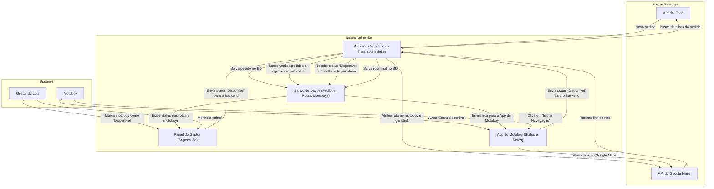

Diagrama de Arquitetura - Sistema MotoRotas (Fluxo Automatizado)
Este diagrama ilustra a arquitetura com a lógica de agrupamento e atribuição de rotas totalmente automatizada pelo sistema.

```mermaid
graph TD
    subgraph "Fontes Externas"
        iFood_API["API do iFood"]
        Google_Maps_API["API do Google Maps"]
    end

    subgraph "Nossa Aplicação"
        Backend["Backend (Algoritmo de Rota e Atribuição)"]
        Database["Banco de Dados (Pedidos, Rotas, Motoboys)"]
        Backoffice["Painel do Gestor (Supervisão)"]
        AppMotoboy["App do Motoboy (Status e Rotas)"]
    end

    subgraph "Usuários"
        Gestor["Gestor da Loja"]
        Motoboy["Motoboy"]
    end

    %% Fluxo de Pedidos e Agrupamento Automático
    iFood_API -- "Novo pedido" --> Backend
    Backend -- "Busca detalhes do pedido" --> iFood_API
    Backend -- "Salva pedido no BD" --> Database
    Backend -- "Loop: Analisa pedidos e agrupa em pré-rotas" --> Database

    %% Fluxo de Atribuição de Rota (Disparo)
    Motoboy -- "Avisa 'Estou disponível'" --> AppMotoboy
    AppMotoboy -- "Envia status 'Disponível' para o Backend" --> Backend
    
    Gestor -- "Marca motoboy como 'Disponível'" --> Backoffice
    Backoffice -- "Envia status 'Disponível' para o Backend" --> Backend

    %% Lógica de Atribuição
    Backend -- "Recebe status 'Disponível' e escolhe rota prioritária" --> Database
    Backend -- "Atribui rota ao motoboy e gera link" --> Google_Maps_API
    Google_Maps_API -- "Retorna link da rota" --> Backend
    Backend -- "Salva rota final no BD" --> Database
    
    %% Fluxo do Motoboy com a Rota
    Database -- "Envia rota para o App do Motoboy" --> AppMotoboy
    Motoboy -- "Clica em 'Iniciar Navegação'" --> AppMotoboy
    AppMotoboy -- "Abre o link no Google Maps" --> Google_Maps_API

    %% Fluxo de Supervisão
    Database -- "Exibe status das rotas e motoboys" --> Backoffice
    Gestor -- "Monitora painel" --> Backoffice
```