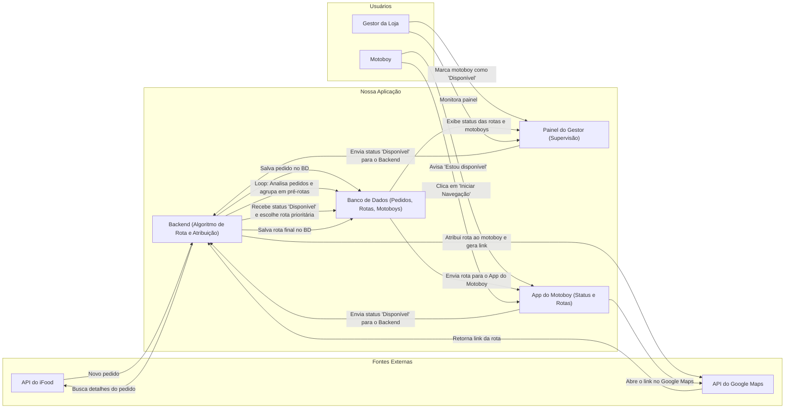

Otimizador de Rotas iFood - Prova de Conceito (Python)
Este repositório contém o código inicial em Python para se conectar e autenticar com a API do iFood.

Passos para Configuração

Crie o Arquivo de Credenciais:

Renomeie o arquivo .env.example para .env.

Abra o arquivo .env e cole suas credenciais do iFood.

Instale as Dependências:

Com o ambiente virtual ativo, execute no terminal:

pip install -r requirements.txt

Execute o Teste:

Ainda no terminal, execute o comando:

python main.py

Resultado Esperado:

Se tudo der certo, você verá o accessToken e outras informações no seu console, confirmando a conexão com a API do iFood

Diagrama de Arquitetura - Sistema MotoRotas (Fluxo Automatizado)
Este diagrama ilustra a arquitetura com a lógica de agrupamento e atribuição de rotas totalmente automatizada pelo sistema.

